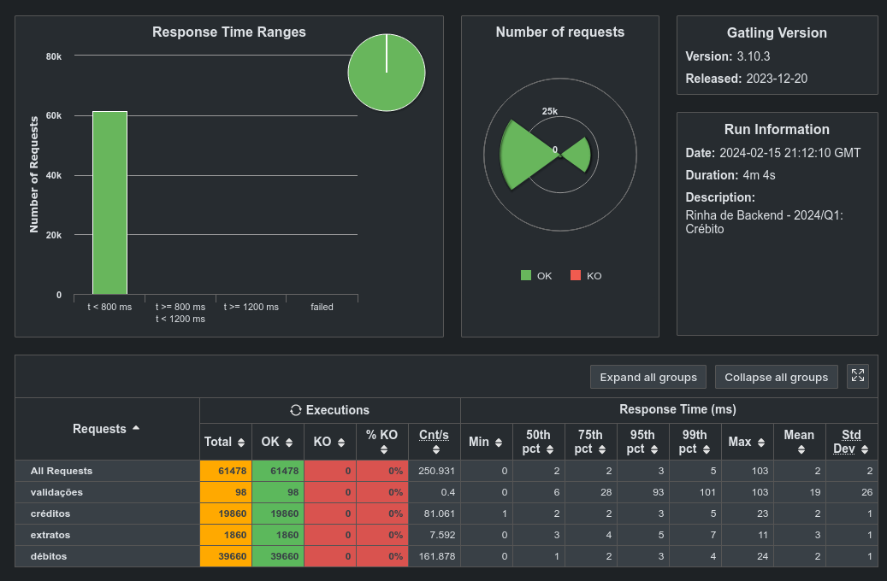

# Rinha 2024-Q1

### Muita fé nessa stack
- Go 1.21
- Fiber
- Postgres
- Sqlx
- Nginx
- Agua benta

### Benchmarks:



### Rodar esse grande projeto

versão dev:

```bash
bash run_dev.sh
```

versão prod (final pra rinha):


```bash
docker-compose up 
```

### Util

- [Docker golang minimal image](https://medium.com/@pavelfokin/how-to-build-a-minimal-golang-docker-image-b4a1e51b03c8)
- [Fiber](https://docs.gofiber.io/)
- [Sqlx](https://jmoiron.github.io/sqlx/)